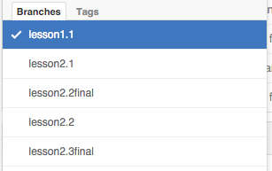
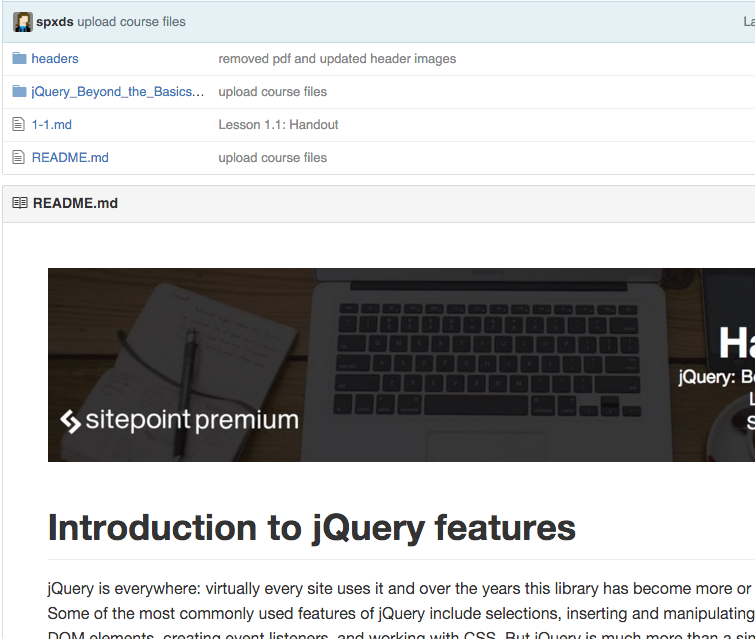

#Course Repositories

We use GitHub to hold all our courses code samples. Each course is given its own repository. Branches are used to organise the contents of the course lessons, this includes code samples, written content and handouts.

##Branches
Branches are organised per lesson/step and lesson stage. What this means is that every lesson/step in a course has it's own branch. 

###Types of branches
Branches are named after the course lessons. All lessons will have their own branch. They will contain starting code samples, written content and handouts.

If a lesson works through a code sample and has a final result that differs from the code used in the start of the lesson (because you've added to the code). That final result will be shows in it's own branch. Why? So we can put both branches side by side and show you a comparison. We refer to these branches as the final branches. 

###Branch naming conventions
We know that we have two types of branches, the standard branch per lesson in a course. We also have a final branch that shows the final result of a code example when the lesson has been completed. The naming conventions for these are slightly different:

**Lesson branches** are named accordingly to its lesson. A branch made for lesson 2.1 in a course outline will be named: lesson2.1

**Final lesson branches** are named slightly different to its lesson branch. A branch with a final code result will be named: lesson2.1final

**_why?_**
Our system automatically picks up the branch names within a course and makes the repo content accessible within the site. It uses the naming convention as a keyword and is able to make the connection between the repo and course system.

##Show me examples

Sure thing, take a look at our jQuery course repository.

When we look at the branches, we can see that we have lesson1.1, lesson2.1, lesson2.1final and so on. _lesson2.1final_ is an example of a final lesson branch.

Now let's take a look at an actual branch. This is lesson1.1, you can see that it conttains a couple of .md files of information. This is an .md version of a branch handout. Basically it caters as our written content, everything that is discussed/mentioned in the lesson.
