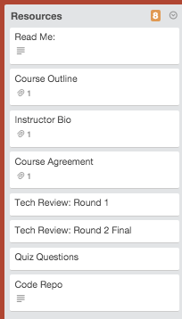

#Trello for Courses
As mentioned with screencasts, we like having our production process information available for all parties involved. 

How? Trello. We keep track of our process on Trello.

As soon as your course has been confirmed and contracted, a Trello board will be made for your course.

##I see my board but what does it mean?
A course board is made up of different columns. Each column represents a new stage in the production process. 

The steps you should see will include:

###- Resources
	- Each assets/lesson in a course is represented by a card. All information regarding the asset is available within the card. You can move cards to different sections to display where in the production process that card is currently found.
- Assets in creation
- Assets created
- Code and slide review
- Ready to film
- Videos in progress
- Video recorded
- Video in builder
- Tech edit
- Tech edit completed
- Teacher edits
- Quiz created
- Quiz completed
- In final edit
- Code sample in GitHub
- Set up in builder
- Videos in builder confirmed
- Video poster in progress
- Video poster done and ready for builder
- Ready for caption
- Captions in progress
- Captions done and ready for builder
- Ready for chapter marker
- Chapter marker in progress
- Chapter marker done and ready for builder
- Handout images in progress
- Handout images done
- Handouts in progress
- Handouts in GitHub
- Ready to launch
- Launched!
- Course added to Onsist
- Promotional video created
- Facebook post in progress
- Promoted on Facebook
- SitePoint post in progress
- Promoted on SitePoint

##Cards
Each assets/lesson in a course is represented by a card. All information regarding the asset is available within the card. You can move cards to different sections to display where in the production process that card is currently found.

##Columns
###Resources
This column will have some pre-made cards available. These cards will hold information regarding the course and contributor making the course (you).

###Assets in creation
All cards in this colum mean that the lesson code samples (in GitHub) and/or slides are currently being created.

###Assets created
Cards in this column have completed slides and code samples and now ready for its first review.

###Code and slide review
All the assets for the course (code, repo and slides) are now being technically reviewed. All feedback can be found linked to from the **Technical Review: Round 1** card.

###Ready to film
Cards in this column have gone through their first technical review, feedback has been presented to their contributor (you) and is now ready for the next stage, video recording.

###Videos in progress
As each lesson is recorded, a new card is brought over to this column.

###Video recorded
The video has been recorded, edited and now sent to the team via Digital Pigeon.

###Video in builder
All videos that have been sent and placed into the course builder are listed in this column.

###Tech edit
Once all videos in a course has been set up into a course, it is ready to be technically reviewed again. This time your entire code repository, slides and videos will be reviewed.

###Tech edit completed
Hurray! Your review has been completed. You'll receive all your feedback in the **Technical Review: Round 2** card.

###Teacher edits
_If_ you need to make changes from the review feedback then those lessons that require changes are listed here. 
###Quiz created

###Quiz completed
###In final edit
###Code sample in GitHub
###Set up in builder
###Videos in builder confirmed
###Video poster in progress
###Video poster done and ready for builder
###Ready for caption
###Captions in progress
###Captions done and ready for builder
###Ready for chapter marker
###Chapter marker in progress
###Chapter marker done and ready for builder
###Handout images in progress
###Handout images done
###Handouts in progress
###Handouts in GitHub
###Ready to launch
###Launched!
###Course added to Onsist
###Promotional video created
###Facebook post in progress
###Promoted on Facebook
###SitePoint post in progress
###Promoted on SitePoint