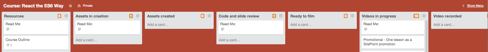

#Trello for Courses
As mentioned with screencasts, we like having our production process information available for all parties involved. 

How? Trello. We keep track of our process on Trello.

As soon as your course has been confirmed and contracted, a Trello board will be made for your course.

##I See My Board, But What Does All of This Mean?
###Cards
Each assets/lesson in a course is represented by a card. All information regarding the asset is available within the card. You can move cards to different sections to display where in the production process that card is currently found.

###Columns
A course board is made up of different columns. Each column represents a new step in the production process. 
The steps you should see will include:
 - **Resources** - Each assets/lesson in a course is represented by a card. All information regarding the asset is available within the card. You can move cards to different sections to display where in the production process that card is currently found. This column will have some pre-made cards available. These cards will hold information regarding the course and contributor making the course (you). 

 - **Assets in Creation** - All cards in this colum mean that the lesson code samples (in GitHub) and/or slides are currently being created.

 - **Assets Created** - Cards in this column have completed slides and code samples and now ready for its first review.

 - **Code Sample in GitHub** - Every course has it's own GitHub repositories. These repositories will hold all code samples (and handouts) for a course. For more information on the way your course code samples are organised, have a read of [Course repositories](https://github.com/learnable-content/contributor-documentation/blob/master/Contributors/CourseRepositories.md).

 - **Code and Slide Review** - All the assets for the course (code, repo and slides) are now being technically reviewed. All feedback can be found linked to from the **Technical Review: Round 1** card.

 - **Ready to Film** - Cards in this column have gone through their first technical review, feedback has been presented to their contributor (you) and is now ready for the next stage, video recording.

 - **Videos in Progress** - As each lesson is recorded, a new card is brought over to this column.

 - **Video Recorded** - The video has been recorded, edited and now sent to the team via Digital Pigeon.

 - **Video in Builder** - All videos that have been sent and placed into the course builder are listed in this column.

 - **Technical Edit** - Once all videos in a course has been set up into a course, it is ready to be technically reviewed again. This time your entire code repository, slides and videos will be reviewed.

 - **Technical Edit Completed** - Hurray! Your review has been completed. You'll receive all your feedback in the **Technical Review: Round 2** card.

 - **Teacher Edits** - _If_ you need to make changes from the review feedback, then those lessons that require changes are listed here.

 - **Quiz Created** - Whilst your course was being reviewed, you should have had time to work on creating quiz questions. Once your questions have been created you can attach your quiz questions to the **Quiz Questions** card found in the Resources column. Drag this card over to this **Quiz created** column and ping me into the card. I'll then get cracking and create your quizzes.

 - **Quiz completed** - Once the quiz has been created and linked to the course, the **Quiz created** card will be found in this column.

 - **In Final Edit** - From here on out, I will be working with the Course Helpers to get your course ready for publishing. Cards in **In final edit** are currently being edited (slightly) for publishing.

 - **Set Up In Builder** - All cards in this column have been edited and exported for publishing. This means they're in the course builder.

 - **Video Poster in Progress** - Our Course Helpers will be creating course posters for each lesson (video) in your course. Cards in this area are currently having their posters made.

 - **Video Poster Done and Ready for Builder** - Well posters have been made for the video and now placed in the builder

 - **Videos in Builder Confirmed** - I'll get you to have a look over your course to make sure it's A-OK.

 - **Captions in Progress** - All cards in this column have been sent off for captioning and will be reviewed. Feel free to sit back and relax, our Course Helpers are handling this stuff.

 - **Captions Done and in the Builder** - Captions have been made, reviewed and now in the builder. Next step, chapter markers.

 - **Chapter Markers in Progress** - Our Course Helpers are working to create chapter markers for your videos. **What are they?** They're video bookmarks that allow viewers to skip to different "segments" in your video. Once again, nothing you need to do here.

 - **Chapter Markers Done and in the Builder** - Our brilliant Course Helpers have made chapter markers for your video and placed them in the builder.

 - **Handout Images in Progress** - Handouts will be made for your course but we need to create some banner images for these handouts. Cards in this column means one of our Course Helpers is currently working on that for you.

 - **Handout Images Done** - Handout images are ready. Now, to create the handouts.

 - **Handouts in Progress** - A handout isn't complete without content. This is what one of our Course Helpers is currentl working on. They'll be reviewing your content, transcripts and packaging it into a pretty neat handout; one per video.

 - **Handouts in GitHub** - Once the handouts are complete, they'll be stored in your GitHub repository, along with your code.

 - **Ready to Launch**- Done! It's ready to go but just waiting on one thing, the publishing date. I'll let you know when that is. 

 - **Launched!** - _It's live!!!_ Now feel free to boast about it online. I mean, why not, _you_ made it!

 - **Course Added to Onsist** - No one likes stealing, especially when it's your work. We'll make sure that doesn't happen. When a card is in this area, I've done just that.

 - **Promotional Video Created** - One last thing, we need to promote your video. As one of the videos that needed to be created, you should have worked on picking a lesson from your course you'd like to use a promotional video. When you see a card in this column, I've started editing your promotional video (if needed). Please provide some copy for the promotional video, this will be used as the SitePoint article text. Have a read of [Additional Videos](https://github.com/learnable-content/contributor-documentation/blob/master/Contributors/Additional-Videos.md) for more information.

 - **Facebook Post in Progress** - We like to publish your promoted video in as many places as possible. Our Facebook social page is one of those.

 - **Promoted on Facebook** - Published!

 - **SitePoint Post in Progress** - We're making an article for your promotional video! 

 - **Promoted on SitePoint** - Wow, what a journey! We're done, that's it. You're promotional article on SitePoint has been made. Once again, be proud of your work, boast and share on all your social media channels. 

**Congratulations — You have a published course!!!**

