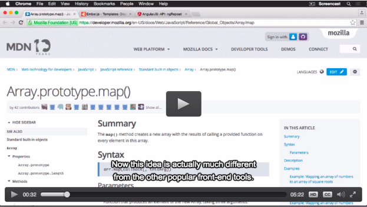

#Video Tutorial Format
We're looking for content that will appeal to intermediate and advanced developers, especially actionable, outcome-focused tips. 

##What's on your screen?
To clarify: the video is entirely screen recordings — you won’t use your computer’s camera to record your face. No need to worry about your hairstyle or your lighting set-up! There's also no need to have slides in your video tutorial.

When you are displaying interfaces, zoom into the areas that require attention to detail or will improve viewer focus. 

When displaying code, increase your font size to improve readability. This is particularly important for those watching your video content on a portable device.

##How to present
Your videos should start with a clear statement of the topic ("Today we're going to look at variables in Swift"), then jump right into the problem at hand. Imagine you’re showing a friend or colleague what you’re working on. Speak your thoughts or explain what you’re typing out loud, even if it feels a bit silly — there shouldn’t be much silence in these videos. If you’re using existing code in your video, give a brief explanation of what the code does and how you’ll be modifying it. 

Your conclusion should be similarly brief, wrap up what you did in one sentence.

Once your video tutorial is complete, I'll add a short introduction and a title slide to your video before release.

##Tone and feel
I know you're excited about creating your video tutorial, so let it show! Let your personality shine; smile, be passionate, be entusiastic and have a conversation with the viewer. Don't be scared to engage with the viewer, in fact we recommend it. Ask them to share their results, ask them for suggestions, ask for their opnions, drop in now and then and say hi. We also have Teaching Assistants who will jump in and respond to discussions/conversations when you can't, but starting a conversation and fostering enagagement and activity is great and something we want you to bring into your content. Our viewers will love you for it.  

##What to avoid
Avoid having code or other important content placed at the bottom 1/6 of the video. We publish captions with all videos and it may interfere/clash with the caption text. Refer to the image below as an example. 

