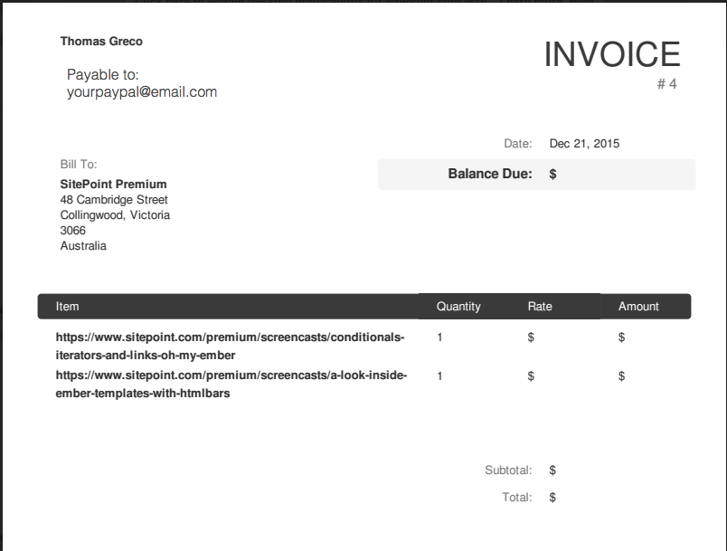

#Invoicing us
If you're looking at this page, you're probably ready to send me an invoice for some completed work. Congratulations, you've been published!

When invoicing we ask that you email your invoice to me (angela.molina@sitepoint.com). 

**Note:** SitePoint.com have a different invoicing method, so please *do not invoice through their web form*.

##Things to include in your invoice

- Your name
- Your payment method (we recommend PayPal)
- Production item (screencast or course)  
- Rate and total due

Everything else is optional.

