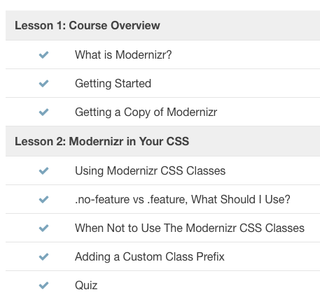
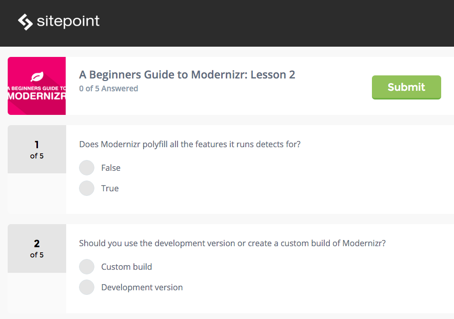
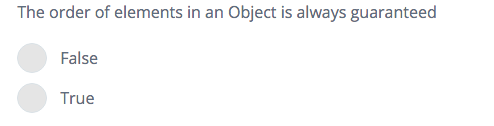
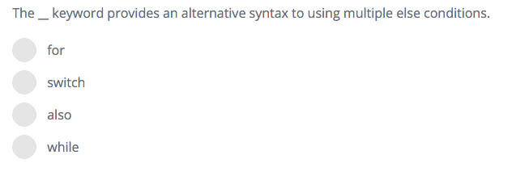
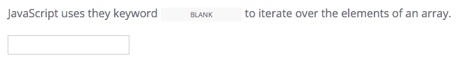

#Quizzes
Every course has a quiz available between every couple of lessons to help consolidate the learning. This means if a course is made up of 5 lessons; lesson 2 and 4 will most likely have a quiz.

##Tell me more...
We create course quizzes for you using Sit the Test system. What we need from you, are the questions. Once we have your quizzes, you can sit back and relax as your course is only one step closer to completion.
 

##Types of questions
Sit the Test allows you to create a few different types of quiz questions. These are:

- **True/False**

- **Multiple choice**

- **Fill in the blank (text)**

- **Image based**

##How many questions and quizzes

As mentioned before we ask for one quiz every couple of lessons. Each quiz should consist of 5 questions. Just write up your questions in a document and highlight the correct answer. Send these to angela.molina@sitepoint.com.

If you have any further questions about the quizzes, please reach out to me (Angela).