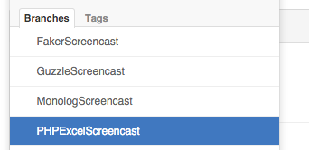
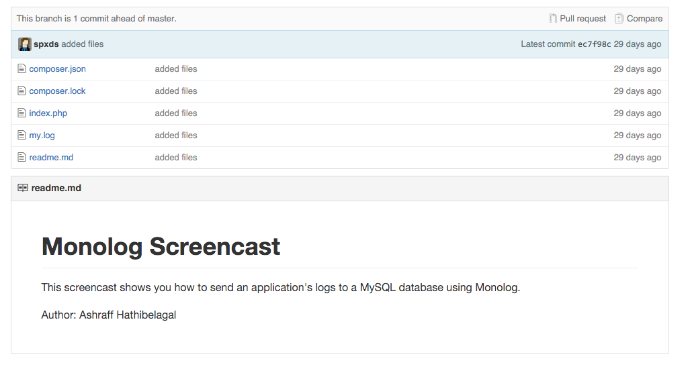

#Video Tutorial Repositories

We use GitHub for all video tutorials code samples. All contributors will be provided with their own repository. For every video tutorial containing code samples, a branch should be made. 

All branches in a contributor repo should contain the code needed for a video tutorial. The branch should be labeled in a way that makes it clear which video tutorial it's contributing towards.

An example of this can be see with Ashraff's video tutorial repository.

Each video tutorial created by Ashraff has a new branch made that contains the video tutorial sample code. They're labeled clearly so they can easily identify which video tutorial the branch relates to.

The contents of the video tutorial has a .md file with a brief description of the branch contents. It also contains the code sample for the video tutorial.

