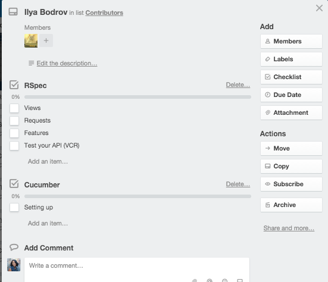

#Trello for Screencasts
We like to have our screencasts production visible for all contributors and SitePoint content team. For this reason we have this informationn available on Trello on our dedicated [SitePoint Short Videos board](https://trello.com/b/5Pn9GZZR/sitepoint-short-videos).

As a SitePoint contributor, you have access to this board. It lists all other contributors, screencast topics available for production, collections available for additional content; this is all followed by the production progress columns.

The exact columns on this board include:

- Topics Up For Grabs
- Collections to Add Content
- Contributors
- Up Next
- Ready to Edit
- In Post-Production
- Ready to Launch
- Live

##Topics Up For Grabs
Any in-demand topics available for production is listed here. 

##Collections to Add Content
Collections that are available on SitePoint Premium are listed into this column. Although these collections are already made, you can still contribute within the collection. We are always happy to see a collection grow. To suggest an idea, ping me (Angela) within the card with your suggestion.

##Contributors
This is a list of all our screencast contributors. Each card represents a contributor. All screencast ideas and/or series that are being made by a contributor is listed within their card.

As soon as a screencast or series is confirmed. I will create the content checklist for contributor. Whilst working on a screencast, the contributor (you) are responsible for moving the screencast card into it's respective column, indicating it's current status. Once the card reaches _Ready to Edit_, I will take over the screencast card and updated the cards movements based on what stage in the production process the screencast is currently.

##Up Next
Cards that are shown in this column are currently being worked on by their contributors. As a contributor, you should make sure that you create your screencast card and move it into this column. 

##Ready to Edit
Cards shown in this column have been submitted through Digital Pigeon to SitePoint Premium. The screencast will then be reviewed and feedback provided. If no feedback is required, it will soon be edited for SitePoint Premium. 

Once a screencast is being prepared for publishing, I and the course helpers begin to work with the video before it's made live. 

At this stage, you should provide copy for your screencast. Your screencast description should be a paragraph written for your audience from a first person perspective. You want to be informative, fun and engaging. 

**An example of great copy is:**
>Ever see that commercial where the couple is sitting down to enjoy an on-demand movie and they’re suddenly inundated in a sea of movie boxes?

>If you’re a PHP developer, chances are you’ve had that same feeling (minus the videos bopping your noggin) as you try to work with the wide variety of code libraries available. Save yourself by incorporating Composer, a robust dependency manager for PHP. In this short screencast, Joe Lowery will show you how to get up and running with Composer—along with its companion service, Packagist—and become a more efficient coder, rising with the tide of all those cool PHP frameworks and libraries rather than drowning in them. Composer, ahoy!

##In Post-Production
Once cards are in this column, they've been edited and being prepared for the site. They could additionally be waiting for either:

- captions
- copy
- video posters
- a SitePoint Post (depending on type of content)

##Live
Once your card makes it into this column, it's been published. If you've just seen it make the move — Congratulations! It's now on our site.

You can now [send me an invoice](https://github.com/learnable-content/contributor-documentation/blob/master/Contributors/Invoicing.md).

#How and what?
##How to use Trello
If you're unfamiliar with Trello, please ready through this [handy guide](https://trello.com/guide/board_basics.html) to help you get started. 

##How to create a screencast card
Ready to work on one of your listed screencast ideas? Did you know there's an easy way to  create a card from your listed item?

Click on the listed item, as if you're going to edit the text. You will then be presented with the options to either edit the text, convert to card, or delete the listed item. You want to choose _convert to card_.

Once you have converted your listed item into a card, it will automatically be listed as the last card in the column. Scroll down and find your card. Assign yourself as the card member and drag it over to the _Up Next_ column.

##Dates on a card
Once your card has been edited, it will be assigned a release date. This is shown on the bottom right corner of your screencast card.

##Labels on cards
You may notice your card has a green or red strip; this is a label. Content on SitePoint Premium is mostly member only. However, there is some free content. Free content has a green label, and will be available for all SitePoint Premium visitors once made live. This content will also be published as a SitePoint post. Red labels represent member-only content which will be available only on SitePoint Premium.

