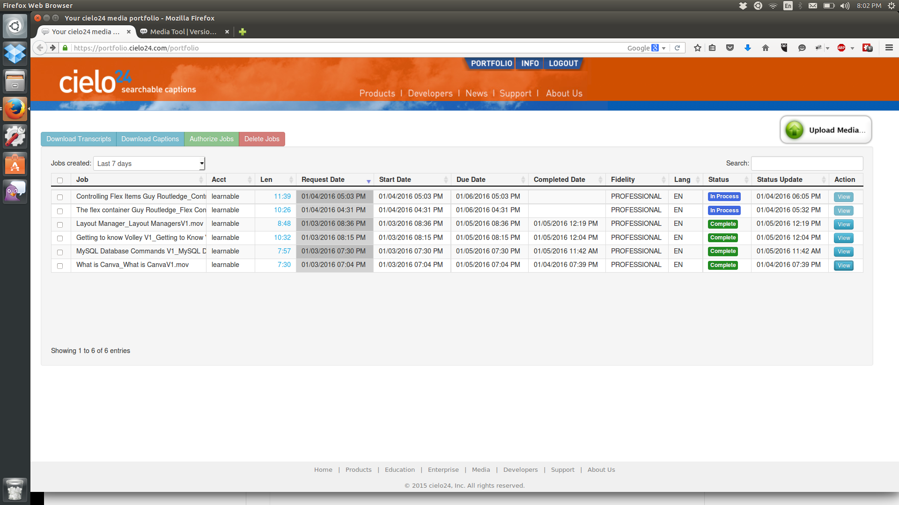
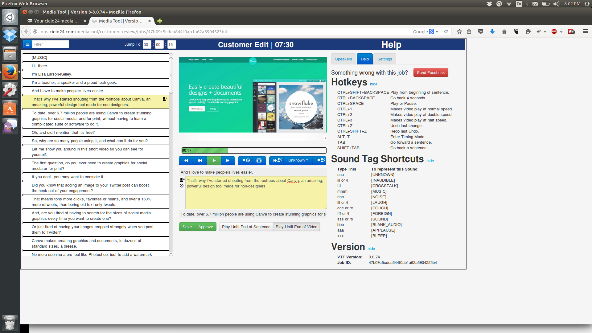

# How to Edit and Submit Video Captions

As part of the work on SitePoint Premium courses, the individual screencast videos are sent off to a service to be captioned. Those videos, and the captions, are then returned to us, and the option is there for us to watch/listen to them, and to review and edit the captions ourselves.

## How Cielo 24 Works

Cielo 24 is a service that allows us to view each video alongside its returned captions. In the [SitePoint Cielo24 Portfolio](https://portfolio.cielo24.com/portfolio), you can see a list of all of the caption jobs that have recently been submitted or completed.

Each set of captions is broken into lines (sentences, typically) and all of the captions are searchable, as well. As the video is played within the editor, you can see the caption line center screen, stop the video, edit it, and save your changes in a very intuitive manner.

## Editing Captions

To edit a caption, either allow the video to play to the line which you are interested in editing, or, to speed the process you may skip through lines on the navigation panel on the left side of the screen.

Copy can be misspelled, accidental words can be inserted or left out, and sometimes misunderstood/mistyped entirely. There can also be a need for adding or correcting things that refer to code, such as function, variable, or class names - capitalization and spacing are important here - or a need to add quotations around commands or terms to make it understood what they are (example: Next, use "top" to get an idea of your server's current resource usage. Here, quoting "top" indicates that we're using a command called top, rather than just writing the word and expecting a reader to catch that.

When editing, ensure that you click the green "save" button after each alteration, so that your changes are saved. Lines that have been altered will show up highlighted in the captions panel on the left side of the screen, so that if you scroll back through the captions you'll have an easy time spotting altered lines.

## Downloading and Uploading Captions

When you are finished, make sure your changes are saved, and head back to the Cielo Portfolio screen. Once there, check the box next to the course you just edited, and select "Download Captions". This brings up a popup, in which you should select "More Options". Here, besides the default options already set, you should change "Replace commong slang terms" to True. You should go to the "Select Sounds to Hide" area and ensure that the following are checked off:
 - Unknown
 - Inaudible
 - Crosstalk
 - Music
 - Foreign
 - Sound
 - Blank Audio

Once done with this, click download. Then, login to https://sitepoint.com/premium/admin. Find the course that you are working with, and click the link to open it. At the bottom there will be a section to "edit video" - and on the next screen you will see three editing areas, one of which is a place to upload/update captions. Use this dialogue to upload the captions file you just downloaded, then hit the save button below it to finish.

Now, you may go to the screencast, if live, to look over your captions and double check their veracity. 
