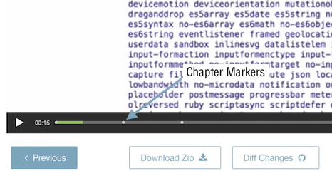

# How to work on chapter markers

Chapter markers allow the students to jump ahead to "bookmarked" points of a video, chapters. You will need to identify where a chapter marker should be placed within a video. Chapter markers also play a secondary role, they also make transcripts, through the one file.

When working on chapter markers, you will need to create the file from the captions. In order to do this you will need to duplicate the caption file and rename it, identifying it as a chapter file.

# Some rules with chapter marker:

When creating a chapter marker (saving the original file) the naming convention should be similar to the captions; course name, chapter, lesson number and version number. An example of this: IntroGitChapter2.5v1
You want to have a chapter marker at the very start of the video, e.g. 00:00:00.
You want to have at least 3 or more chapter markers in a video.
Chapter marker formats are slightly different to captions: Chapter 1
00:00:00 (start timestamp, hour:mins:seconds) --> 00:00:00 (end timestamp, hour:mins:seconds)
Chapter marker title.

# Example chapter markers file

This is how a chapter marker file would look like.

Chapter 1  
00:00:00 --> 00:01:30  
Introduction to lesson  

