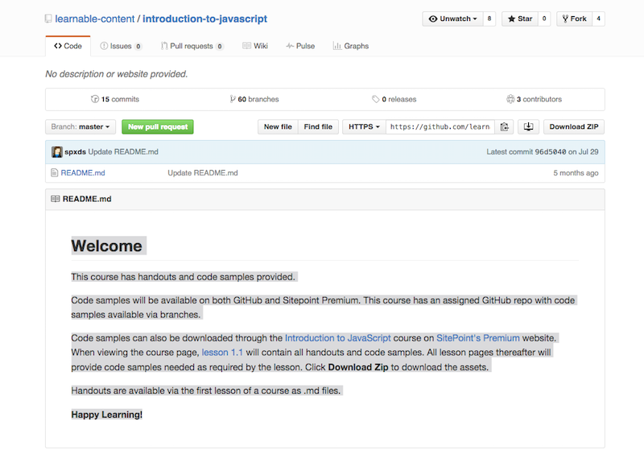
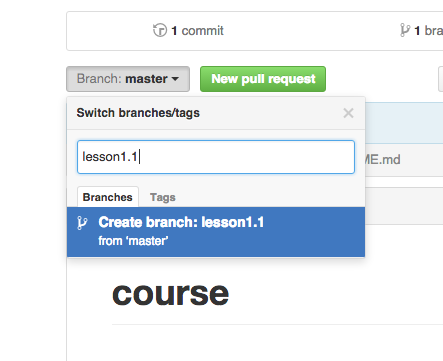
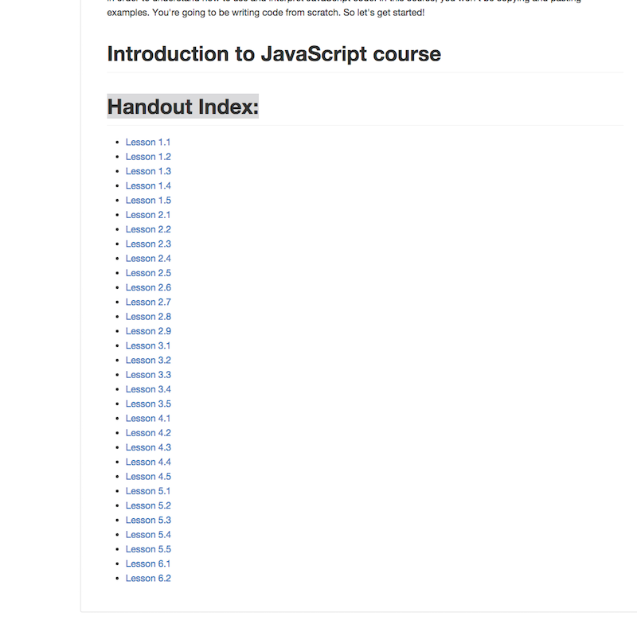

#### How to set up a course repositories

#### Creating the repository
Go to the SitePoint Premium repository on Github — https://github.com/learnable-content. You may need permission to create the repository, if this is the case contact Angela. 
*Note:  if you are creating the Github repository from scratch then name it with the course name (i.e. Modernizr 3)*

#### After the repository is created

* Initialize the repo through Github.com, commandline or a Git application (i.e. Source Tree)
* **Create a Welcome Readme.md document for the Master Branch**
  Use a text editor or the Github editor to create the Readme.md document like shown in the example. You can use [Introduction to JavaScript](https://github.com/learnable-content/introduction-to-javascript) repo, master branch read me as a template.
*Note. All readme's or text at Github will use Markdown so make sure you are familiar  with Markdown (https://help.github.com/articles/markdown-basics/)*
  

  After the Readme.md file is created and you have committed it to the repo it will be shown on Github like this.
  

#### Create branches

Creating a branch is fairly easy. You can use the commandline, Github.com or even a Git application to do this.

At Github.com you first want to click on the Branch:Master button; it's a dropdown.

After clicking on the Branch: Master button, a dropdown like this will appear.

In the "Find or create branch" box, you can enter the name of the branch which would be lesson1.1  *_Note All branches for the course will be named lesson1.1, lesson1.2, lesson2.1 etc. in the course._*

After you entered a new branch name, hit enter. You will immediately be taken to your newly created branch

#### What goes into the branch
Each course will have code samples will be provided by the author of the course. The handout files are also provided and can be downloaded or forked at https://github.com/learnable-content/Course-Handouts. These handouts will need to go into each lesson branch of the course.

#### Setting up

* The master branch will have a readme.md.

* lesson1.1 branch will have all the handouts and handout images as this will have the directory index of the course. 

* Each lesson branch will have the readme and code sample. The readme file will be a copy of the handout file for that lesson.
* Each lesson will have a folder that will have the lesson .md, .pdf and images for that lesson. **_i.e. Introduction to JavaScript's repo has Introduction_to_JavaScript_handouts as the folder where the lesson.md, pdf and images are stored._**
https://github.com/learnable-content/introduction-to-javascript/tree/lesson1.2

