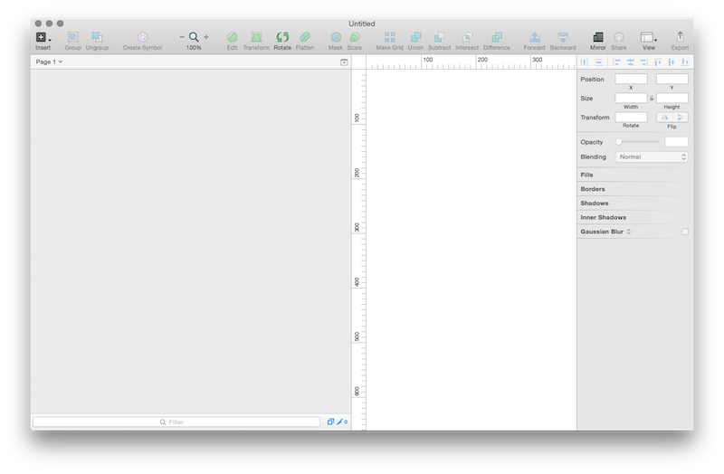
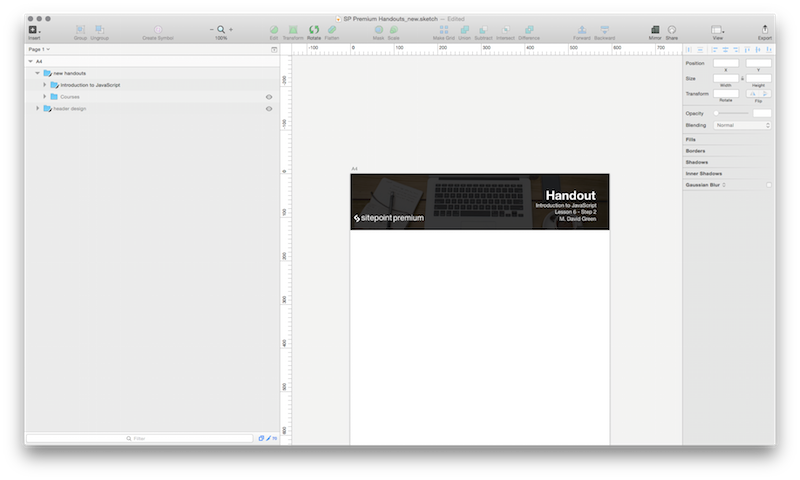
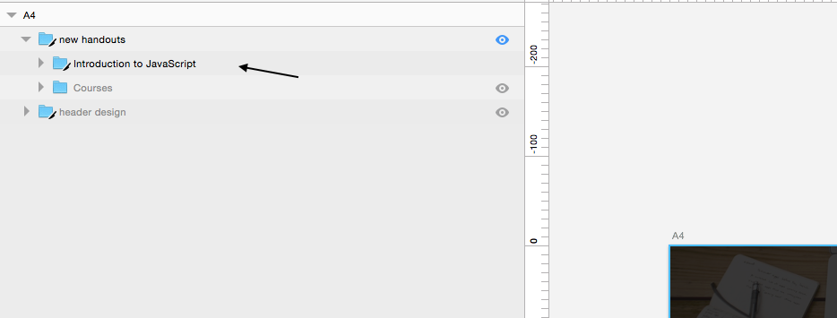
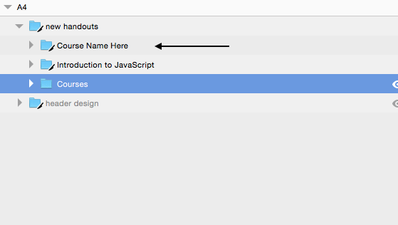
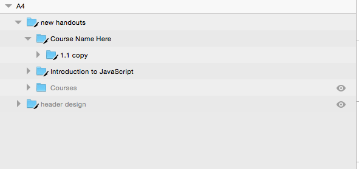
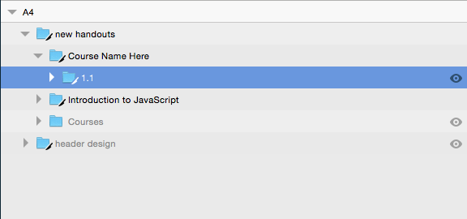
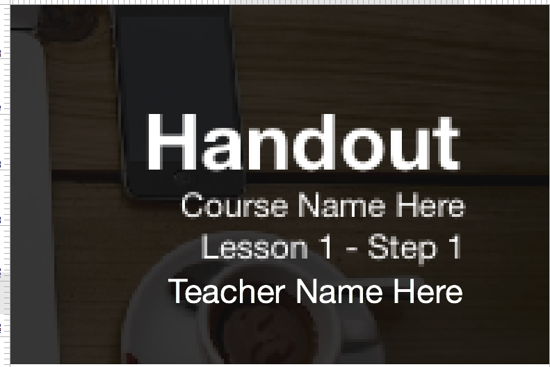
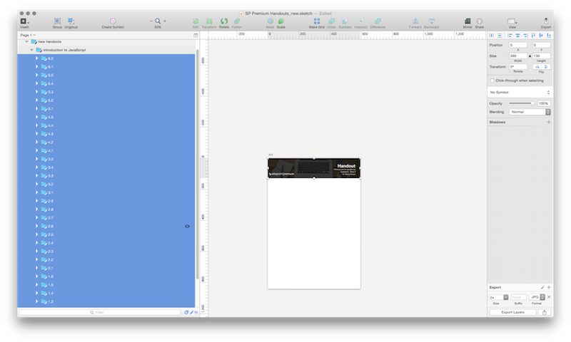
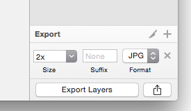

#Handout Images

##What are handout images?
Handout images are basically banner images for each handout in a course. These images are very simple to create.

##Getting Sketch 

1. You need to have a copy of the image editing program called Sketch as the "template file" is for Sketch.
You can download a trial of Sketch at https://www.sketchapp.com/ *_Note: This application is for the Mac OS only._*

##Working with Sketch
1. Next is to download the template file. You can download the template file [here](repo-screenshot-images/SP Premium Handouts_new.sketch).

2. To open up Sketch Click on the orange diamond in the dock.

##Creating the handout image

1. Next Open the document SP Premium Handouts_new.sketch file

2. Once you have the file open look at the left of the screen, you will have Introduction to JavaScript as first option. You can use this course as a template on how each handout file is suppose to look.

##Steps to create a handout image

1. Duplicate the Introduction to JavaScript folder.
2. Rename it to the course you are working on.

3. Open folder and delete all lessons except 1.1copy

4. Rename lesson 1.1copy to 1.1

5. Next Change the Course Name, Change the Lesson  and Step to the correct one and the Teacher's name. **_Note In this example the Lesson would be Lesson 1 - Step 1_**

6. Then just duplicate 1.1 folder and rename it to the next in the lesson and do the same for the lesson and step on the image.

## Exporting

When ready to say the file you go to File> Save. Then you are ready to export. Highlight each lesson file on the left as shown in the example.

Then on the  bottom right you see an export screen. Just hit export. **_Note Be sure to keep the size at 2x. We want the size to be 1190 width 260 height.

##Example of a finished handout image

That is it for creating handout images. Be sure you follow the course's video outline at SitePoint Premium to see how many steps and lessons they are for each course.

	
