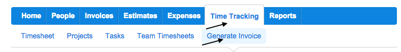
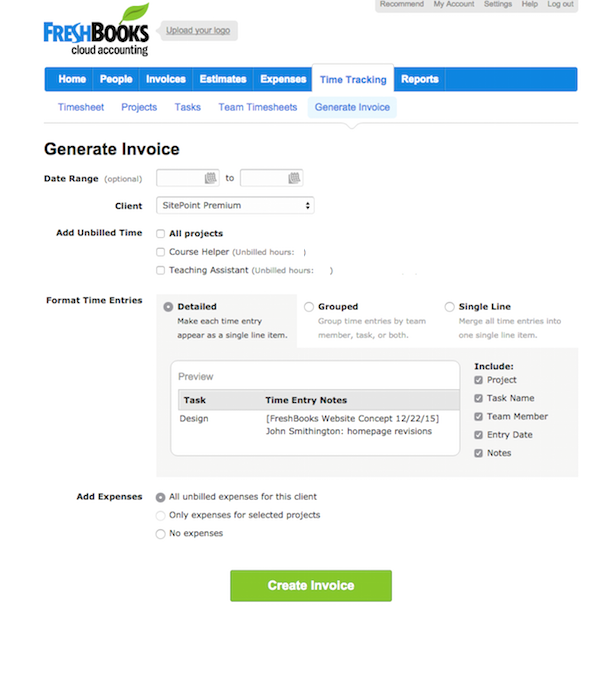

## Invoicing Us

So, you are ready to generate and submit your first invoice!

## Step 1
Login to Freshbooks. (Already logged in? Continue on step 2!)

## Step 2
Then go to "Time Tracking" then to "Generate Invoice"

Then you come to a screen that should look similar to this:

## Client

The client should be SitePoint Premium, if you have any questions about setting that up. just ask Angela.

## Notes Visible to Client

Be sure to always your PayPal address and your hours for each section( i.e. Teaching Assistant, Course Helper, etc  ) and total hours.

Example of how notes visible to client section should be setup

	PayPal Email Address email@domain.com

	Teaching Assistant: 0 Hours
	Course Helper: 0 Hours
	Total Hours 0 

_Adding your PayPal email address here is how you get paid!_

## Resources
Here is a [video](https://www.freshbooks.com/videos/first-invoice.mp4) that Freshbooks provides that is a great tutorial on creating your first invoice.
