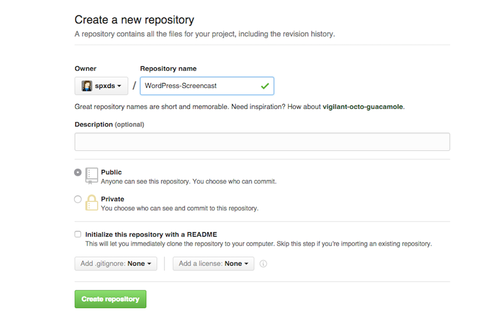
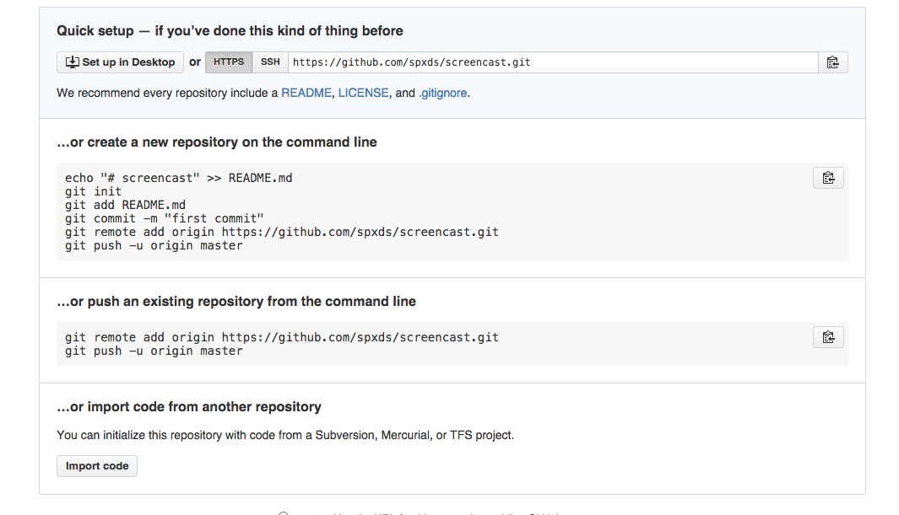
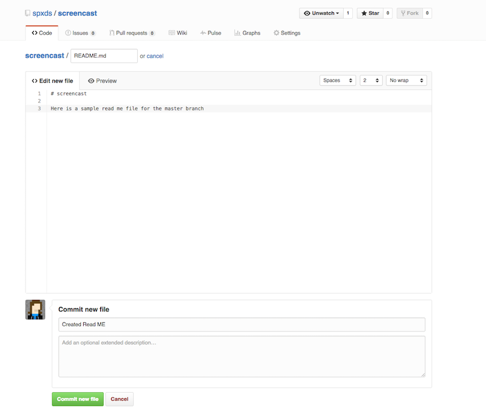
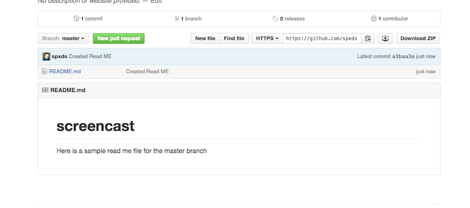
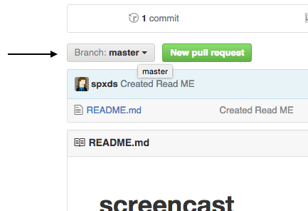
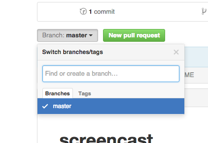
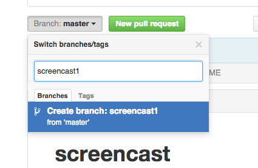
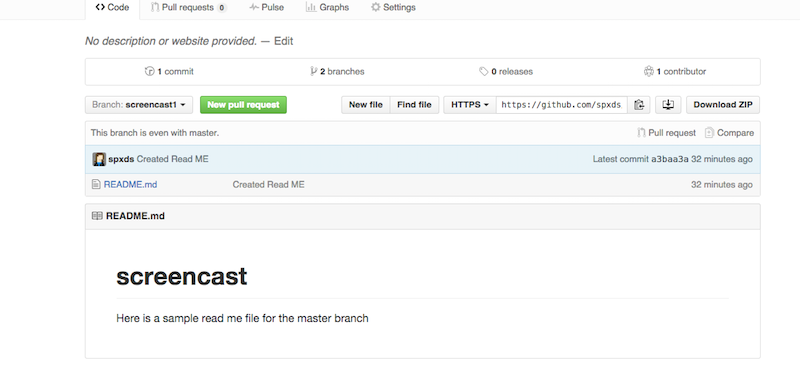

#Repositories
##How to create a screencast repository

#### Creating the repository
Go to the SitePoint Premium repository on Github — https://github.com/learnable-content. You may need permission to create the repository, if this is the case contact Angela. 
*Note:  if you are creating the Github repository from scratch then name it with the persons name or Collection name (i.e. Hathy-screencasts or RSpec-collection)*

#### After the repository is created

* Initialize the repo through Github.com, commandline or a Git application (i.e. Source Tree)
* **Create a Readme.md document for the Master Branch**
  Use a text editor or the Github editor to create the Readme.md document. 
*Note. All readme's or text at Github will use Markdown so make sure you are familiar  with Markdown (https://help.github.com/articles/markdown-basics/)*
  

  After the Readme.md file is created and you have committed it to the repo it will be shown on Github like this.
  

#### Create your first branch

Creating a branch is fairly easy. You can use the commandline, Github.com or even a Git application to do this.

At Github.com you first want to click on the Branch:Master button; it's a dropdown.

After clicking on the Branch: Master button, a dropdown like this will appear.

In the "Find or create branch" box, you can enter the name of the branch.

After you entered a new branch name, hit enter. You will immediately be taken to your newly created branch

#### What goes into the branch
Each screencast will have code samples provided by the author. Code samples per screencast are placed in branches of the contributor or series repository. *Angela will  provide a link to the author's repo where you can download or fork the repo to get the code samples.* These files will be  uploaded/commited to the SitePoint Premium screencast repo.

That's how you create a screencast repo! Simple right? 
