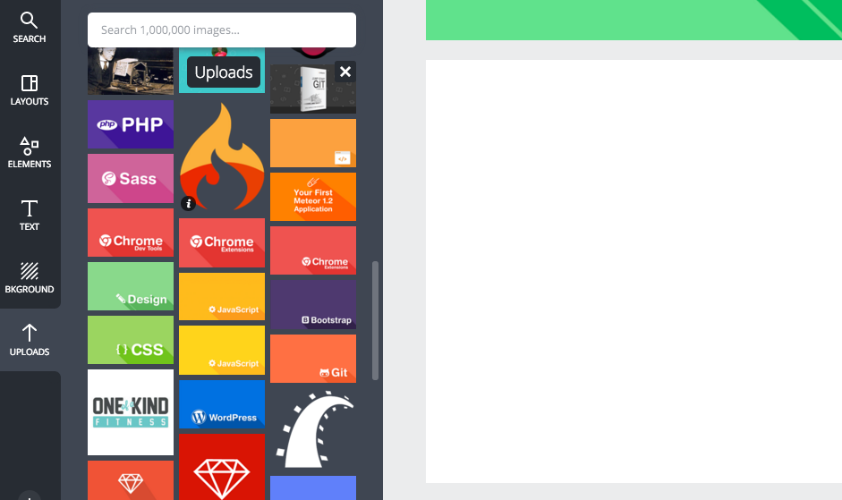
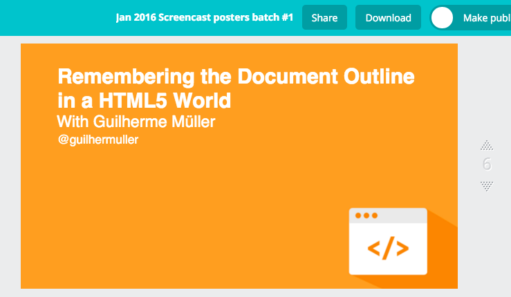
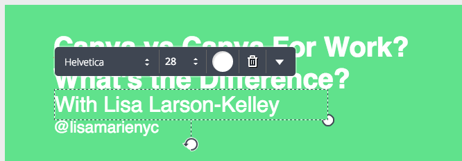
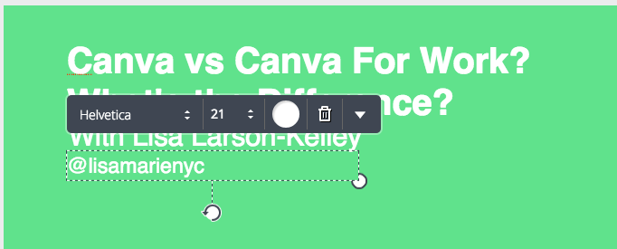
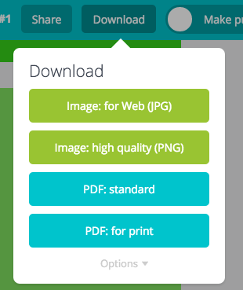
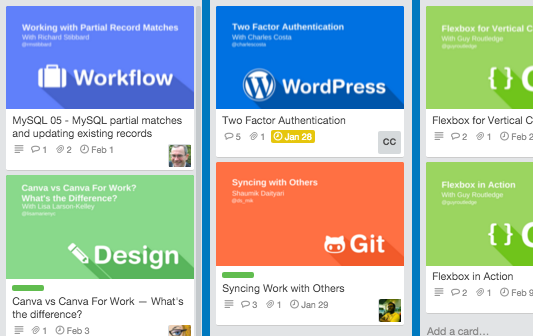

#How to work on screencast posters
Every screencast on SitePoint Premium requires a video poster. When creating these we use [Canva](https://www.canva.com/). 

##What is Canva
Canva is a cloud design service that is accessible with a login. Once logged in, you will see a listing of different projects. All projects will allow you to have 30 canvas's to work with. After 30, you'll have to create a new project. Most projects will be labelled "Month 2016 Screencast Posters". 

##Posters
You will have a range of different background posters available to you, which poster you decide to use depends on the screencast topic. Some of the background posters available include:

- CSS
- React
- JavaScript
- PHP
- Workflow
- WordPress
- Ruby

Once you have selected a poster listed in **Uploads**, drag it onto your new canvas. Now all you need it text

##Text
Once you have a background image set, all you need is to overlay text.
The information you want to display on your poster includes:

- Screencast title
- Author name
- Author Twitter handle

###Screencast title 
Should be listed using title-case. The text should be white (#FFF), use a Helvetica typeface and at size 36.

###Author name and Twitter handle
Each line should be placed beneath the Screencast title. Both lines of text should be white, using a Helvetica font. The author's name is set at size 28 and twitter handle at size 21.

##Done, now what?
At the right side of your poster you will see the canvas number, make note of that number. 

Now you need to download the poster. Click **Download**, this will display the following drop-down list.

If you click either *Image: for Web (JPG)* or *Image: for Web (JPG)*, it will download the entire screencast project. We only want the screencast posters we have just created. Click **Options** to expand the drop-down list. You'll notice that you now have the option to enter the canvas pages you want to download. Once you have entered the canvas pages you wish to download, click *Image: for Web (JPG)*. 

##Next steps
Next you'll have to attach the screencast images to their respective cards on the [SitePoint Short Videos](https://trello.com/b/5Pn9GZZR/sitepoint-short-videos) Trello board. Simply drag the poster image into the card.

