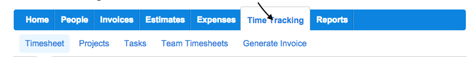
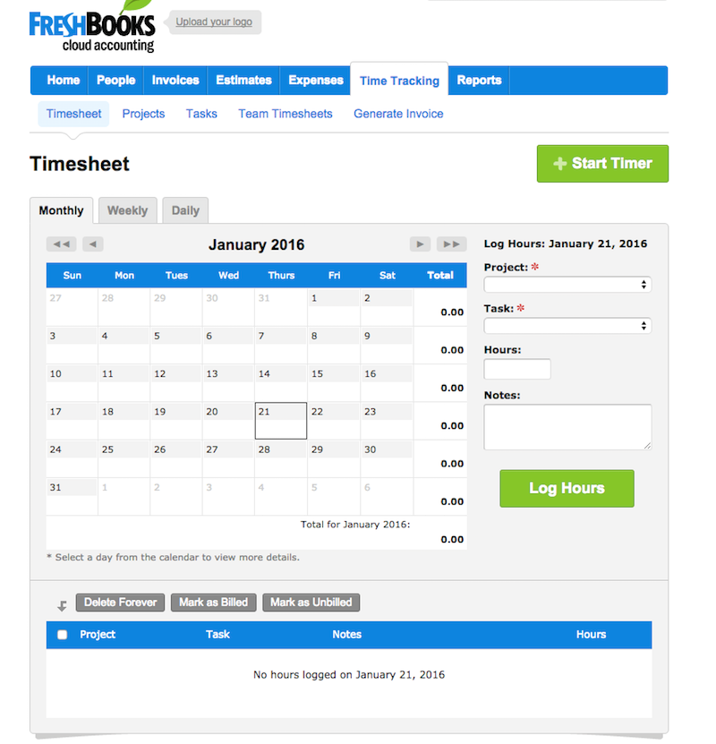
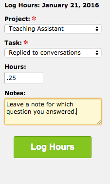
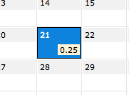

#### Timing tasks in Freshbooks

So you are ready to start logging time?

#### Log into Freshbooks
Login to Freshbooks and go to Time Tracking tab.

After you click on the Time Tracking Tab your screen should look like this.

#### Adding Time
Click on the date you want to track time for. Choose your project, choose your task and add your hours  **_Note: all time is recorded in decimal time_**. Leave a note describing what you were doing if it was replying to a question or doing another task be sure to add it.

After that hit log hours and you have recorded your time.

#### Great resource for adding time
Here is a helpful [video](https://5072dd9eba94b77f9614-0cb1c5c54a990280f1386d1f822e7a25.ssl.cf5.rackcdn.com/time-tracking.mp4)
that Freshbook provides has that shows you step by step on how to adding time tasks.

