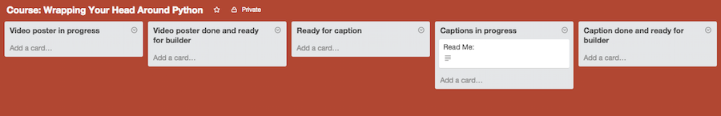
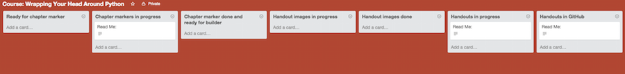

#Trello for courses

They're usually a Trello board for every new course that SitePoint Premium has. If you are assigned to that course then Angela will make you a member of that board. Course helpers are usually in charge of captions, chapter markers, poster images, handout images, and creating the GitHub repos.

##Video Posters
When creating the video posters for the lesson be sure to drag each lesson into the card "Video poster in progress" when finished drag the finished lesson into the Video poster done and ready for builder. Be sure to attach all the images ( in a zip file) to the lesson card and let Angela know that the video posters are finished.

##Captions
Once the course is ready for captions then the course lessons will be in the Ready for captions card. While working on them you'll need to move the course lessons one by one over to "Captions in progress". Once finished with a lesson be sure to move the card to the board labeled "Caption done and ready for builder". Be sure to attach all the captions ( in a zip file) to the lesson card and let Angela know that the captions are finished.

Example of boards for Video Posters, and Captions

##Chapter Markers
When chapter markers are ready all lessons cards will be in "Ready for Chapter Marker". Move each lesson card in Chapter markers in progress as you are working on them. Once finished with each lesson then move it's card into "Chapter marker done and ready for builder". Be sure to attach all the chapter markers ( in a zip file) to the lesson card and let Angela know that the chapter markers are finished.

##Handout Images
When it's time to do the handout images, be sure to  move each lesson card in the "Handout images in progress" while you are working on it. When you are finished be sure to move the card to "Handout images done". Be sure to attach all the  handout images ( in a zip file) to the lesson card and let Angela know that the handout images  are finished.

##Handouts
When it's time to do the handouts, be sure to  move each lesson card in the "Handout in progress" while you are working on it. When you are finished be sure to move the card to "Handouts in GitHub". Be sure to let Angela know that the handouts are finished.

Example of boards for Chapter Markers, Handout Images and Handouts 

